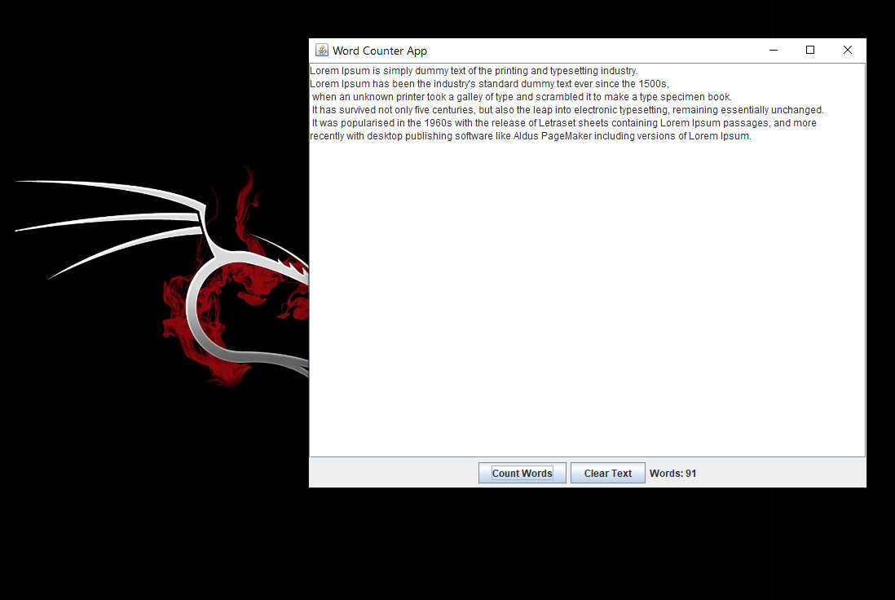

# CodeAlpha_JAVA_TASK2_WORD_COUNTER.
<h2> Word counter app in JAVA SWING LIBARAY My 2ND task in java @CodeAlpha. </h2>
<h3> Description of Word Count Java Swing Application : </h3>
The Word Count Java Swing Application is a simple desktop utility built using Java's Swing framework. It allows users to input text in a text area and calculates the number of words in the input. Designed with an intuitive graphical user interface (GUI), this application is ideal for beginners to learn Java Swing concepts while solving a practical problem. The tool is lightweight, efficient, and provides a clean and user-friendly interface for users to interact with.

<h3>Features : </h3>
<ol> 
<li>Text Input Area: A scrollable JTextArea for users to enter or paste text.</li>
<li>Word Count Button: A button to trigger the word count calculation.</li>
<li>Clear Button: An option to reset the input area for fresh text.</li>
<li>Word Display: A JLabel to display the total word count dynamically.</li>
<li>Logo Integration: Optional branding by including an application logo.</li>
<li>Real-time Feedback: Accurate counting of words regardless of input size.</li>
</ol>
  <h3> Benefits : </h3>
<ol>
    <li>
        <strong>Practical Application</strong> 
        Helps users easily determine the number of words in any given text, useful for writers, students, or anyone working with word limits.
    </li>
    <li>
        <strong>Educational Tool</strong> 
        Serves as a beginner-friendly project to understand Java Swing, GUI layouts, event handling, and text manipulation. 
        Introduces concepts like:
        <ul>
            <li><code>JFrame</code> for the application window.</li>
            <li><code>JTextArea</code> for multi-line text input.</li>
            <li><code>JLabel</code> for displaying dynamic results.</li>
            <li>Event handling through <code>ActionListener</code>.</li>
        </ul>
    </li>
    <li>
        <strong>Lightweight and Fast</strong> 
        The application is fast, with a minimal memory footprint, making it suitable for everyday use on any Java-enabled system.
    </li>
    <li>
        <strong>Customizable and Extendable</strong> 
        Developers can easily extend the application with additional features like:
        <ul>
            <li>Real-time word counting using a <code>DocumentListener</code>.</li>
            <li>Character counting.</li>
            <li>Exporting the word count results to a file.</li>
        </ul>
    </li>
    <li>
        <strong>Cross-Platform Compatibility</strong> 
        Built using Java, it can run on any platform (Windows, macOS, Linux) without requiring major modifications.
    </li>
    <li>
        <strong>Productivity Enhancement</strong> 
        Provides quick insights for individuals working with content writing, document reviews, or text formatting, ensuring their work adheres to specific word counts.
    </li>
</ol>

## Screenshot

 
